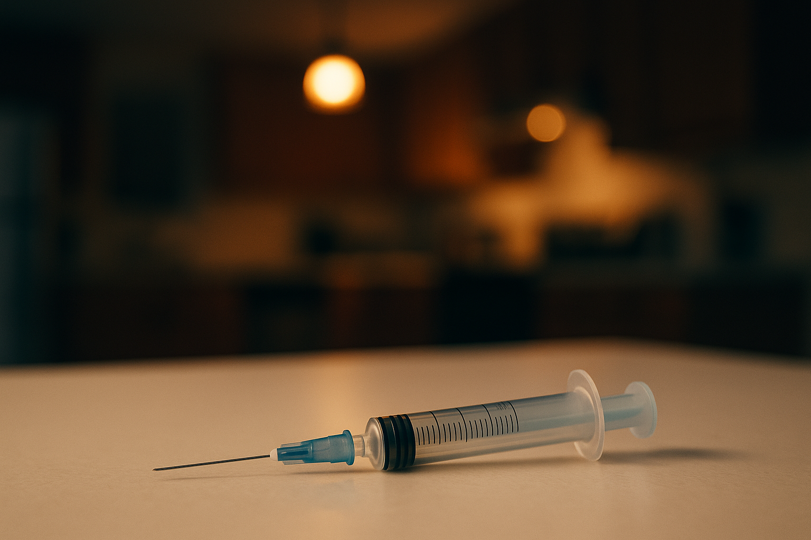
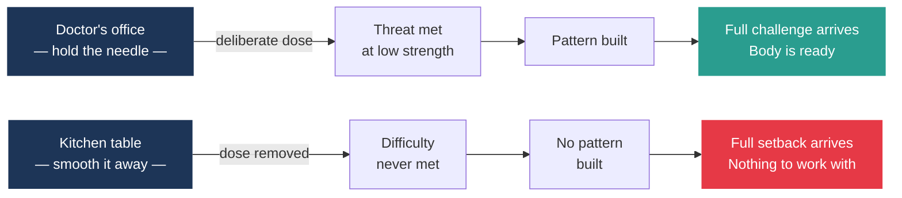
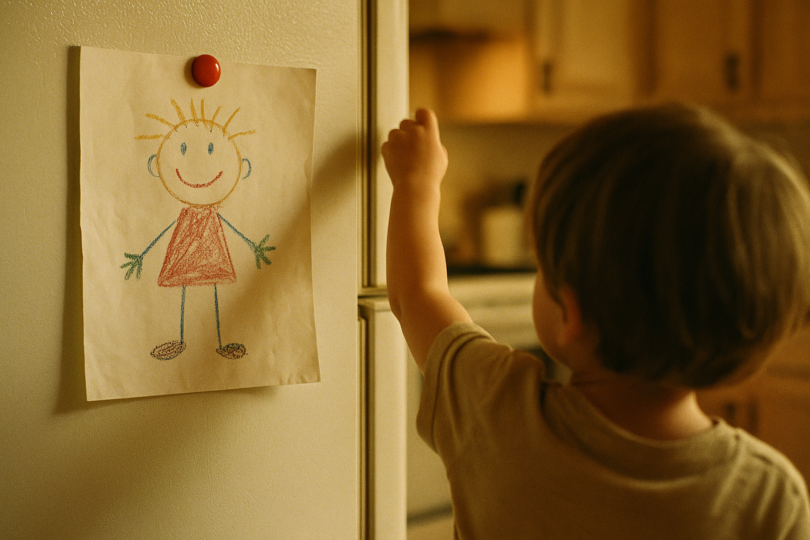
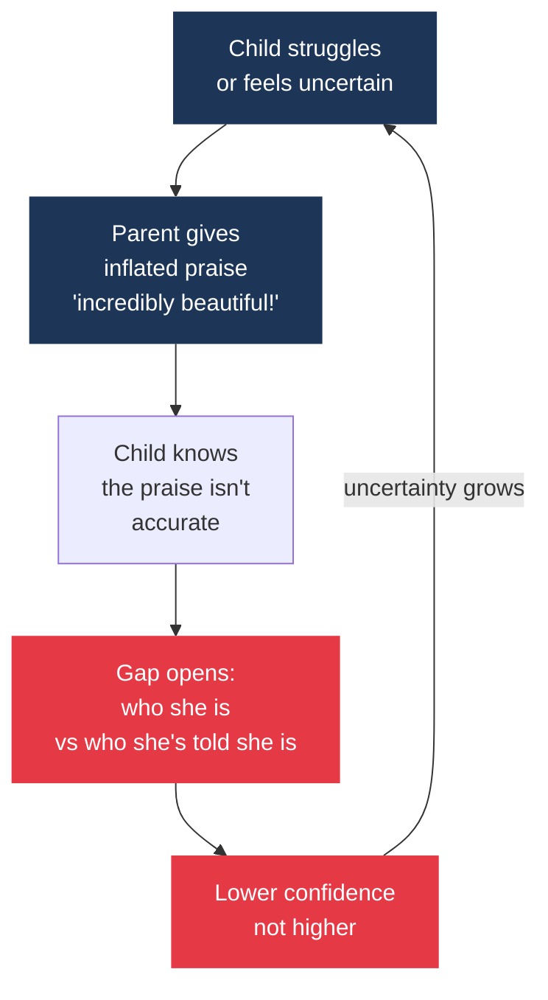

# You Have Already Done This

*All images in this article were generated with AI.*

> *Resilience is the mind's vaccine. Think how vaccines work: exposed to tiny amounts of virus, the body mounts an immune response; when the virus infects one later in life, the body, already prepared, knocks it out.*
>
> — S. Nassir Ghaemi, *A First-Rate Madness*

You hold your daughter's leg while the nurse preps the needle. She is six months old. You know what is about to happen. She doesn't. You know she will scream and you will not stop it.

She screams. Actual screaming. Tears down both cheeks. You keep your hands exactly where they are.

You know what you are doing. The vaccine works because the immune system has to meet the pathogen — at a controlled dose — before the full-strength version arrives.[^1] Without that dose, the immune system has no memory of the threat. When the real thing comes, it has nothing to work with. So you hold her leg. She screams. That is the point.

You drive home. You give her Tylenol. She is fine.

Five years later, she comes home from school crying because Emma said her drawing was not very good. You feel the pull the moment you see her face.

You tell her the drawing is beautiful. You tell her Emma was being mean. You say all of it quickly, because watching her cry is unbearable and you want the crying to stop.

She calms down. She goes to her room. You go back to the kitchen.

You do not know, yet, that you have just applied a different principle than the one at the doctor's office. At the doctor's office, you held her still so she could receive something uncomfortable. In the kitchen, you moved in quickly so she would not have to. At the doctor's office, you were giving her a dose. In the kitchen, you removed one.

Same parent. Different principle. You did not notice the difference. Nobody has shown you, yet, that there was one.

That is what this is about.

## 1. The Turn Made Sense

Someone you know — probably someone you are related to — carries a moment from their childhood they have never fully told you about. A teacher who embarrassed them in front of a classroom. A coach who made them feel small for months. A father who withheld affection as a control mechanism. They are in their fifties now and they still flinch when a boss gives them feedback. They do not connect the flinch to that classroom. They just think they are bad at feedback.

They are not bad at feedback. They were taught that criticism was a weapon. The teacher, the coach, the father — they were teaching a lesson all right. Just not the one they thought.

This is what the therapeutic turn was replacing. Not merely some occasional harsh word, but a whole system. Silence at the dinner table. The coach who said "you throw like a girl" and everyone laughed and nobody made it stop. The father who never said he was proud of you, not once. The mother who said she was proud and then listed everything you had done wrong. The shame that moved around the dinner table like a plate everybody had to take from.

In 1986, California passed a law creating a task force to promote self-esteem.[^2] Within a decade, the idea that children needed to feel good about themselves had become the default in schools and living rooms across the country. It was not a conspiracy. It was a rescue.

And it was rescuing children from something real.

Two researchers eventually did the math. Gershoff and Grogan-Kaylor. Seventy-five studies, a hundred and sixty thousand children, every effect they could measure.[^3] Seventy-one percent pointed at harm. Of the effects big enough to be sure of — ninety-nine percent.

That is the regime the therapeutic turn was responding to. Not a philosophy. A body count.

But physical punishment was only the visible edge of it. A separate study — the largest of its kind — looked at nine thousand five hundred adults and asked what different kinds of childhood hardship had done to the grown-ups they became.[^4] The researchers did not only count beatings. The list included emotional abuse. Emotional neglect. Watching a parent drunk or in handcuffs. Growing up in a house where no one ever said your name with kindness. Children who had four or more of those experiences — four or more — were four to twelve times more likely as adults to struggle with depression, substance abuse, or suicidal thoughts. That is not a small effect. That is a public health catastrophe, happening in ordinary houses, behind closed doors, for generations.

The parents who started the movement to change this were right about what they were replacing. Full stop.

## 2. And Then We Overcorrected

Your nine-year-old is at the kitchen table with her math homework. A problem she cannot do. You watch her. You feel the pull. You know — because you have read the article, listened to the podcast, absorbed the instruction from your pediatrician — that the right move is to sit with her feelings. The wrong move is to say "just try it." So you say: "This is hard, and it's okay to feel frustrated."

She cries harder. You sit with her. An hour later the homework is undone. She is in her room. You are cleaning the kitchen. You are not sure what just happened. You did everything the articles told you to do. That is what just happened.

What happened is that you removed the dose.

The research on praise is specific enough to sting. Dweck and Mueller ran six studies on a hundred and twenty-eight fifth graders. They gave each child a problem. When the child solved it, half got "you must be smart." The other half got "you must have worked hard."[^5] Then came the next round — another problem, harder or easier, the child's choice.

The "smart" kids chose easier. They avoided what might test them. The "worked hard" kids chose harder. They wanted to test themselves.

One phrase built confidence. The other built a wall — a wall between the child and anything that might disprove the thing she was told she was.

Dweck wrote about this in a practitioner article with the blunt title "Caution — Praise Can Be Dangerous."[^6] This was 1999. The caution was not widely heard. Warnings about praise do not travel the way praise itself does. What parents absorbed from Dweck's work was "praise effort, not results." What they applied was something closer to "praise constantly." Those are not the same thing. One is a scalpel. The other is a firehose.

The problem runs deeper than praise. It is friction. Difficulty. The experience of not knowing the answer yet.

Researchers tried something. Give a student a hard problem before you teach them anything. No instruction. Just the problem. They do better than the student who got taught first.[^7] Fifty-three studies. Twelve thousand kids. Same pattern.

The mechanism is simple. Struggle primes the mind. It pulls up everything the student already knows and points it at the problem. When instruction arrives, it lands in a slot that's already been shaped for it. Instruction on unprepared ground floats. Instruction on prepared ground fits.

Strongest for older kids — middle school and up. But it holds across ages and subjects.

The hour at the kitchen table, sitting with her feelings while the homework stayed undone — that was not a kindness. It was a removal. The struggle was the thing. You smoothed it away before it could do its work.

A tree grown in a greenhouse without wind grows tall and thin. The wood never densifies. The roots never widen. It looks fine from the outside. That is what happens when the load is removed.[^8] The tree grows toward the wrong shape. She looks fine indoors. Outside is a different question.

Bone works the same way. Bone that is regularly loaded increases in density. Bone that is never loaded does not stay the same. It loses density.[^9] This is not an injury. It is a design feature. The body continuously remodels itself in proportion to the demands placed on it. Absence of demand is not neutral. It is a choice with consequences.

We thought we were taking the load off. What we were doing was removing the signal.

Nassim Taleb had a line for this: "those who are trying to help us are often hurting us the most."[^17] He was writing about economic systems. But the sentence travels.

Here is what the signal looks like at scale. Since approximately 2012, rates of major depression among American adolescents have risen sharply. Among 12-to-17-year-old girls, the rate of major depression rose fifty-two percent — from 13.1 percent in 2005 to 19.9 percent in 2017.[^10] Self-poisoning among girls aged 10 to 12 quadrupled over the same period. Suicide among girls aged 10 to 14 doubled.

Those numbers are real. They require an honest statement about what we know and what we don't.

Some of what you just read has been argued about. Candice Odgers, writing in *Nature*, has said the case that phones caused this crisis is weaker than its loudest advocates claim.[^11] She is careful — she does not say the crisis is not real. She says we do not yet know how much of it belongs to the phones. That debate is live. The researchers are still arguing.

But whether phones are thirty percent of the cause or sixty or ninety — that is a question about what to do about the phones. This piece is about a different question: what to do about parenting. Parenting is not competing with the phones for the cause of anything. It is the one lever in that whole picture that is actually within your reach. You cannot ban Instagram at a school board meeting tonight. You can decide how you will respond to the next meltdown at the kitchen table.

That is all this piece is asking you to consider.

## 3. She Doesn't Know Where She Is

Her drawings are on the refrigerator. Her teacher says she is thriving. You tell her every night that you are so proud of her.

And also: she has started asking you things, in the small moments — in the car, at bedtime — things like "do you really think I'm good at that?" She is not fishing for more praise. She is trying to find out if the praise is real. She does not know what she is actually good at. She has no map.

She has been told she is wonderful for as long as she can remember. She suspects the adults are managing her.

A 2017 study followed a hundred and twenty parent-child pairs — children aged seven to eleven — over time.[^12] It tracked how often parents gave inflated praise: not just "that's beautiful," but "that's not just beautiful, that's *incredibly* beautiful." Over time, the children whose parents gave the most inflated praise ended up with lower self-esteem, not higher. The paper's own summary of what it found: "Inflated praise may foster the self-views it seeks to prevent." Po Bronson had said it more plainly years earlier: "We expect so much of them, but we hide our expectations behind constant glowing praise."[^18]

The praise was designed to raise the child. The praise lowered her. The mechanism: inflated praise sets a standard the child knows she cannot actually meet. She hears "incredibly beautiful" and she knows — at some level below words — that the drawing is not incredibly beautiful. She cannot reconcile what she was told with what she sees when she looks at the page. So the praise doesn't land as confidence. It lands as a gap. A gap between the child she is and the child she is supposed to be.

An earlier study by the same researchers found something harder to forget.[^13] Parents give the most inflated praise to the children who struggle the most. The children who most need accurate information about what they can and cannot do yet — they get the least accurate information. The child who is uncertain about her drawing gets told the drawing is extraordinary. The child who knows her math is shaky gets told she is so smart. The praise goes exactly where it will do the least good and the most harm.

Alfie Kohn warned about this mechanism decades ago. Too much global positive praise, he wrote, trains children "to make their selves the issue in whatever they do, and thus to be prone to both grandiosity and self-contempt."[^19]

And the original promise of the movement — that high self-esteem would cause children to do better, relate better, live better — it did not hold up either. By the early 2000s, the researchers who had built the self-esteem movement had a problem. When they looked for objective evidence that high self-esteem caused the things they had promised it would cause — better school performance, stronger relationships, better behavior — they could not find it.[^14] The benefits they could confirm were real but limited: people with high self-esteem report feeling happier, and they take more initiative. That is something. It is not everything that was promised. It is not even most of it.

This is college students, not nine-year-olds — but the mechanism underneath is the same. Look at the college-age version of her. The ones whose parents kept stepping in — made the calls, fought the grades, solved the roommate fights — came out less sure of themselves, more anxious, less able to handle being adults. Fifty-three studies. Forty-six thousand college-age kids.[^15]

When you keep solving the hard thing, they never learn they can solve the hard thing. Jonathan Haidt put the broader observation in one sentence: "We have vastly and needlessly overprotected our children in the real world."[^20]

You reach in because watching her struggle is unbearable for you. The meltdown is unbearable for you. The friend's slight is unbearable for you. The undone homework, the missed invitation, the grade you didn't expect — these are unbearable for you. Reaching in is not a failure of love. It is what love feels like from the inside. And also: it teaches her that her discomfort is your problem to solve.

Your nine-year-old is asking "do you really think I'm good at that?" because she does not have enough real information to answer the question herself. She has only the praise. And she suspects the praise is not the same thing as the truth.

What she is looking for — what all children are looking for, underneath the drawings on the refrigerator and the "I'm so proud of you" at bedtime — is a signal she can actually navigate by. A map of what she is and what she is not. What she can do and what she cannot do yet. You cannot give her that map by telling her everything is wonderful. You give it to her by being honest about the parts that are not.

That is the thing we removed.

## 4. Clearer, Not Tougher

A mother in New Haven takes her twelve-year-old to a specialist at Yale. The daughter has panic attacks. She has not slept through the night in six months. She will not go to school. The specialist does something unusual. He does not want to see the daughter. He wants to work with the mother.

A randomized trial at Yale, published in 2020, tested a treatment called SPACE — Supportive Parenting for Anxious Childhood Emotions.[^16] A hundred and twenty-four children, aged seven to fourteen, diagnosed with anxiety disorders. Half got the standard treatment: cognitive behavioral therapy with the child. The other half did something different. The therapist did not treat the child at all. The therapist treated the parents.

The parents learned to stop absorbing the child's avoidance. Stop sleeping in the child's room to prevent separation distress. Stop speaking for a socially anxious child at the dinner table. Stop calling the teacher to smooth out a hard day. Instead, they learned to say — in so many words: I believe you can handle this, and I am here.

The result: the SPACE group did as well as the CBT group. Both treatments reduced the children's anxiety significantly. The SPACE parents reduced what the researchers called "accommodation" — all the ways parents absorb a child's distress and move the distress-causing thing out of the way — far more than the CBT parents did. The mechanism the study identified: when parents stop accommodating, the child stops receiving the signal that their anxiety is correct and dangerous. They receive a different signal. I believe you can handle this.

That signal is not tougher. That signal is clearer.

The word is not "tougher." The word is "clearer."

If your child has diagnosed anxiety, this research is about her. If your child is anxious in the way all nine-year-olds are sometimes anxious — meltdowns, school-refusal days, the homework that ends in tears — the same principle holds.

Alison Gopnik has a useful image for the range. Some children are dandelions — they grow almost anywhere. Others are orchids — they do especially well in rich surroundings and especially badly in poor ones.[^21] Neither is served by a world without weather.

Either way, there is a clinical trial behind this. The treatment that worked by teaching parents exactly what this piece has been describing — stop smoothing the path, send the signal that the child can handle it — was as effective as sending your child to weekly CBT sessions. Yale ran it. The evidence is there. The word is clearer, not tougher.

Nothing in this piece is a defense of harshness. The nurse who holds the needle is not being harsh. She is being clear. She knows what the dose is, and she knows why it matters, and she does not flinch. That is not cruelty. That is the most loving kind of precision.

Even Janet Lansbury, herself a gentle-parenting author, has said it plainly: "Lack of discipline is not kindness, it is neglect."[^22] She does not mean punishment. She means the shape of reliable guidance.

Your daughter does not need you to become a different parent. She does not need you to stop loving her. She needs a clearer signal that her distress is not permanent and she is not broken and she can, in fact, carry this.

The next time at the kitchen table, when the homework is hard and her face goes red — notice the reach.

This is not a new parenting philosophy. You do not have to become a different person. The next time your hand reaches out to smooth something your child could have carried — the missed invitation, the homework she gave up on, the thing the friend said — notice the reach. Then let one small thing stand. Just one. Not a program. Not a commitment. One small thing, on a Tuesday. That is the whole prescription.

The nurse with the needle is not tougher than you. The nurse is clearer.

## 5. The Door Is Still Open

She is twenty-seven and she is calling you from her car outside her office. Three times this month. Her manager gave her feedback — the kind of feedback you would describe, if you heard it secondhand, as reasonable. She is describing it to you as an injustice. You agree with her, because you have always agreed with her.

You hang up. You stand in your kitchen. The kitchen has not changed in eighteen years.

And you realize, quietly, that you are hearing yourself in her voice. Not her words — she has her own. But the shape of the response. The reflex that says: discomfort is a signal that something is wrong. Someone must have done this to you. You did not earn this difficulty. You deserve better.

You taught her that. You did it with love. The love was real. The bill came due anyway.

This is not a verdict on the past. The love was never in question, and the past is not where you live. This is a question about the next time.

Because the next time is still coming. The next meltdown. The next math problem she cannot do. The next friend who said something. The next homework she left undone. The next grade she didn't expect. These moments are not in the past. They are arriving, scheduled, at roughly six p.m. on a Tuesday.

In some of those moments, your hand is going to reach in. Some of them you will smooth. That is fine. The dose does not have to be every time. The vaccination schedule is not "every moment." It is calibrated. Age-appropriate. Specific.

Go back. Your child is six months old. You are holding her leg. The needle goes in. She screams. You do not stop it. Because you know — you have always known — that a small, controlled dose of what she cannot yet handle is how she becomes someone who can handle it. You did not stop it at the doctor's office. You have been stopping it at the kitchen table.

One room over from where she learned that the needle doesn't mean danger. One room over from where she learned that a short, sharp thing can make you stronger. One room over from where you already know this.

The kitchen is still yours. The next moment is still coming. The next time your hand reaches in — notice it. You don't have to pull back every time. Just once. Just one small thing, let it stand.

The door is still open.

## References

[^1]: Pier, G.B., Lyczak, J.B., & Wetzler, L.M. "Fundamentals of Vaccine Immunology." *Journal of Global Infectious Diseases*, PMC 3068582, 2011. [https\://pmc.ncbi.nlm.nih.gov/articles/PMC3068582/](https://pmc.ncbi.nlm.nih.gov/articles/PMC3068582/); CDC. "Principles of Vaccination." *The Pink Book*, Chapter 1. [https\://www\.cdc.gov/pinkbook/hcp/table-of-contents/chapter-1-principles-of-vaccination.html](https://www.cdc.gov/pinkbook/hcp/table-of-contents/chapter-1-principles-of-vaccination.html) <!-- E-03 -->

[^2]: California Task Force to Promote Self-Esteem and Personal and Social Responsibility. *Toward a State of Esteem: The Final Report of the California Task Force to Promote Self-Esteem and Personal and Social Responsibility*. California Department of Education, 1990. ERIC document ED321170. [https\://eric.ed.gov/?id=ED321170](https://eric.ed.gov/?id=ED321170) <!-- E-01 -->

[^3]: Gershoff, E.T. & Grogan-Kaylor, A. "Spanking and Child Outcomes: Old Controversies and New Meta-Analyses." *Journal of Family Psychology*, 30(4), 453–469, 2016. [https\://pubmed.ncbi.nlm.nih.gov/27055181/](https://pubmed.ncbi.nlm.nih.gov/27055181/) <!-- E-14 -->

[^4]: Felitti, V.J., Anda, R.F., Nordenberg, D., Williamson, D.F., Spitz, A.M., Edwards, V., Koss, M.P., & Marks, J.S. "Relationship of Childhood Abuse and Household Dysfunction to Many of the Leading Causes of Death in Adults: The Adverse Childhood Experiences (ACE) Study." *American Journal of Preventive Medicine*, 14(4), 245–258, 1998. [https\://pubmed.ncbi.nlm.nih.gov/9635069/](https://pubmed.ncbi.nlm.nih.gov/9635069/) <!-- E-18 -->

[^5]: Mueller, C.M. & Dweck, C.S. "Praise for Intelligence Can Undermine Children's Motivation and Performance." *Journal of Personality and Social Psychology*, 75(1), 33–52, 1998. [https\://pubmed.ncbi.nlm.nih.gov/9686450/](https://pubmed.ncbi.nlm.nih.gov/9686450/) <!-- E-04 -->

[^6]: Dweck, C.S. "Caution — Praise Can Be Dangerous." *American Educator* (American Federation of Teachers), Spring 1999. [https\://www\.aft.org/sites/default/files/PraiseSpring99.pdf](https://www.aft.org/sites/default/files/PraiseSpring99.pdf) <!-- E-05 -->

[^7]: Sinha, T. & Kapur, M. "When Problem Solving Followed by Instruction Works: Evidence for Productive Failure." *Review of Educational Research*, 91(5), 761–798, 2021. [https\://journals.sagepub.com/doi/10.3102/00346543211019105](https://journals.sagepub.com/doi/10.3102/00346543211019105) <!-- E-08 -->

[^8]: Badel, E., Ewers, F.W., Cochard, H., & Telewski, F.W. "Acclimation of Mechanical and Hydraulic Functions in Trees: Impact of the Thigmomorphogenetic Process." *Frontiers in Plant Science*, PMC 4406077, 2015. [https\://pmc.ncbi.nlm.nih.gov/articles/PMC4406077/](https://pmc.ncbi.nlm.nih.gov/articles/PMC4406077/) <!-- E-11 -->

[^9]: Wolff, J. *The Law of Bone Remodelling* (original formulation, 1892). Clinical summary: Physio-pedia, "Wolff's Law." [https\://www\.physio-pedia.com/Wolff%27s_Law](https://www.physio-pedia.com/Wolff%27s_Law); PMC 6846251 — "Law of Dynamic Deformation of Bone." [https\://pmc.ncbi.nlm.nih.gov/articles/PMC6846251/](https://pmc.ncbi.nlm.nih.gov/articles/PMC6846251/) <!-- E-12 -->

[^10]: Twenge, J.M. "Increases in Depression, Self-Harm, and Suicide Among U.S. Adolescents After 2012 and Links to Technology Use: Possible Mechanisms." *Psychiatric Research and Clinical Practice*, 2(1), 19–25, 2020. DOI: 10.1176/appi.prcp.20190015. PMC 9176070. [https\://pmc.ncbi.nlm.nih.gov/articles/PMC9176070/](https://pmc.ncbi.nlm.nih.gov/articles/PMC9176070/) <!-- E-09 -->

[^11]: Odgers, C.L. "The Great Rewiring: Is Social Media Really Behind an Epidemic of Teenage Mental Illness?" *Nature*, 628:29, 2024. DOI: 10.1038/d41586-024-00902-2. [https\://www\.nature.com/articles/d41586-024-00902-2](https://www.nature.com/articles/d41586-024-00902-2) <!-- E-17 -->

[^12]: Brummelman, E., Nelemans, S.A., Thomaes, S., & Orobio de Castro, B. "When Parents' Praise Inflates, Children's Self-Esteem Deflates." *Child Development*, 88(6), 1799–1809, 2017. [https\://pubmed.ncbi.nlm.nih.gov/28857141/](https://pubmed.ncbi.nlm.nih.gov/28857141/) <!-- E-07 -->

[^13]: Brummelman, E., Thomaes, S., Orobio de Castro, B., Overbeek, G., & Bushman, B.J. "That's Not Just Beautiful — That's Incredibly Beautiful!: The Adverse Impact of Inflated Praise on Children With Low Self-Esteem." *Psychological Science*, 25(3), 728–735, 2014. [https\://pubmed.ncbi.nlm.nih.gov/24434235/](https://pubmed.ncbi.nlm.nih.gov/24434235/) <!-- E-06 -->

[^14]: Baumeister, R.F., Campbell, J.D., Krueger, J.I., & Vohs, K.D. "Does High Self-Esteem Cause Better Performance, Interpersonal Success, Happiness, or Healthier Lifestyles?" *Psychological Science in the Public Interest*, 4(1), 1–44, 2003. [https\://journals.sagepub.com/doi/10.1111/1529-1006.01431](https://journals.sagepub.com/doi/10.1111/1529-1006.01431); updated: Baumeister, R.F. & Vohs, K.D. "Revisiting Our Reappraisal of the (Surprisingly Few) Benefits of High Self-Esteem." *Perspectives on Psychological Science*, 2018. [https\://pubmed.ncbi.nlm.nih.gov/29592638/](https://pubmed.ncbi.nlm.nih.gov/29592638/) <!-- E-13 -->

[^15]: McCoy, S., Dimler, L.M., & Rodrigues, M. "Parenting in Overdrive: A Meta-analysis of Helicopter Parenting Across Multiple Indices of Emerging Adult Functioning." *Journal of Adult Development*, 32, 222–245, 2024. DOI: 10.1007/s10804-024-09496-5. [https\://link.springer.com/article/10.1007/s10804-024-09496-5](https://link.springer.com/article/10.1007/s10804-024-09496-5) <!-- E-10 -->

[^16]: Lebowitz, E.R., Marin, C., Martino, A., Shimshoni, Y., & Silverman, W\.K. "Parent-Based Treatment as Efficacious as Cognitive Behavioral Therapy for Childhood Anxiety: A Randomized Noninferiority Study of Supportive Parenting for Anxious Childhood Emotions." *Journal of the American Academy of Child & Adolescent Psychiatry*, 59(3), 362–372, 2020. DOI: 10.1016/j.jaac.2019.02.014. PMC 6732048. [https\://pmc.ncbi.nlm.nih.gov/articles/PMC6732048/](https://pmc.ncbi.nlm.nih.gov/articles/PMC6732048/) <!-- E-16 -->

[^17]: Taleb, N.N. *Antifragile: Things That Gain from Disorder*. Random House, 2012. The "trying to help us are often hurting us the most" language recurs in Taleb's writing on fragilized systems; the parallel to neurotically overprotective parenting is Taleb's own.

[^18]: Bronson, P. & Merryman, A. *NurtureShock: New Thinking About Children*. Twelve / Grand Central Publishing, 2009. Chapter 1: "The Inverse Power of Praise."

[^19]: Kohn, A. *Punished by Rewards: The Trouble with Gold Stars, Incentive Plans, A's, Praise, and Other Bribes*. 25th Anniversary Edition. Houghton Mifflin Harcourt, 2018 (orig. 1993).

[^20]: Haidt, J. *The Anxious Generation: How the Great Rewiring of Childhood Is Causing an Epidemic of Mental Illness*. Penguin Press, 2024. Cited here for the overprotection observation; the phones-causation strand of Haidt's larger argument remains contested — see [^11].

[^21]: Gopnik, A. *The Gardener and the Carpenter: What the New Science of Child Development Tells Us About the Relationship Between Parents and Children*. Farrar, Straus and Giroux, 2016. Chapter 1: "Against Parenting."

[^22]: Lansbury, J. *No Bad Kids: Toddler Discipline Without Shame*. JLML Press, 2014.

## Further Reading

- Dweck, C.S. *Mindset: The New Psychology of Success*. Random House, 2006. — The primary source on growth mindset and the intelligence-vs-effort praise distinction; essential context for E-04 and E-05. The pop-misreading of Dweck's work is the article's central mechanism; reading her directly corrects it.
- Haidt, J. *The Anxious Generation: How the Great Rewiring of Childhood Is Causing an Epidemic of Mental Illness*. Penguin Press, 2024. — The most prominent recent argument about adolescent mental health deterioration; directly adjacent to E-09 and contested by E-17 (Odgers). Not cited because the article takes no position in the phones debate; essential background for understanding why Odgers matters.
- Kapur, M. "Productive Failure in Mathematical Problem Solving." *Instructional Science*, 38(6), 523–550, 2010. — The foundational paper behind the meta-analysis cited as E-08; provides the mechanism for why struggle before instruction works where instruction first does not.
- Lebowitz, E.R. *Breaking Free of Child Anxiety and OCD: A Scientifically Proven Program for Parents*. Oxford University Press, 2021. — The SPACE protocol described in E-16, written for parent audiences. The clearest available guide to what "accommodation reduction" looks like in practice; directly answers CA-5 (the mother of the diagnosed-anxious child) in full.
- Lythcott-Haims, J. *How to Raise an Adult: Break Free of the Overparenting Trap and Prepare Your Kid for Success*. Henry Holt, 2015. — Contextual secondary for E-10; the most accessible book-length treatment of helicopter parenting and its outcomes in college-age adults. Good further reading for the secondary audience segment (parents of 15–22-year-olds).

