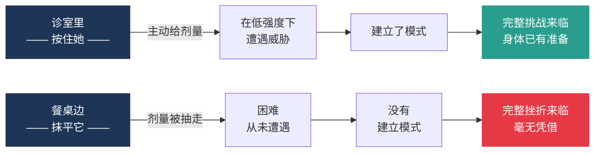
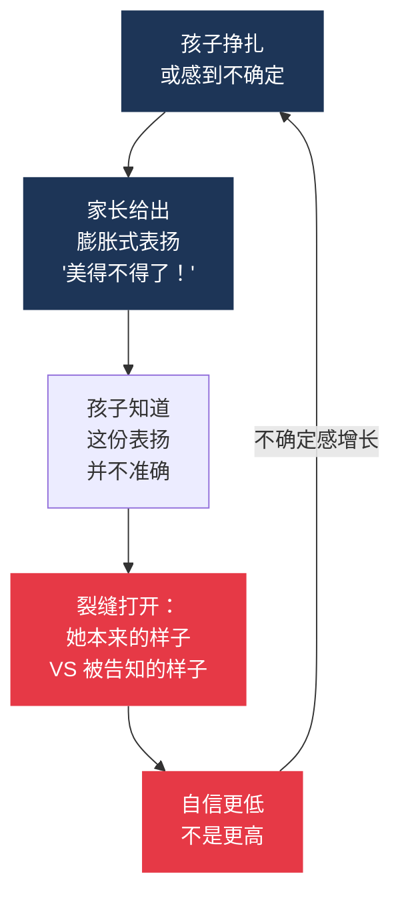

# 这件事你早就做过

*本文所有配图均由 AI 生成。*

> *心智的韧性，就是大脑的疫苗。想一想疫苗是怎么工作的：身体先接触到极少量的病毒，免疫系统随之被调动起来；等日后真正的病毒入侵，身体早已做好准备，一击即溃。*
>
> —— S。纳西尔·加米 (S. Nassir Ghaemi)，《一流的疯狂》(A First-Rate Madness)

你按住女儿的腿，护士正在准备针头。她六个月大。你知道接下来会发生什么。她不知道。你知道她会尖叫，而你不会阻止。

她真的尖叫了。整张脸哭得通红，眼泪从两颊滚下来。你的手按得稳稳的，纹丝不动。

你清楚自己在做什么。疫苗之所以有用，是因为免疫系统必须先见到病原体 —— 在受控的剂量下 —— 然后才能在足量病原体入侵时挡住它。[^1] 没有那一次剂量，免疫系统对这个威胁毫无记忆。等真正的病来了，它手里什么也没有。所以你按住她的腿。她尖叫。这正是重点。

你开车回家。你给她吃了泰诺 (Tylenol)。她没事。

五年后，她从学校哭着回来，因为艾玛 (Emma) 说她的画画得不怎么样。你看见她的脸的那一刻，就感觉到一股拉力。

你告诉她画得很漂亮。你告诉她艾玛说话太刻薄。你把这一切说得飞快，因为看着她哭让你无法忍受，你只想让哭声停下。

她平静下来了。她回了自己的房间。你回到餐桌边。

你还没意识到，此刻你用的原则和诊室里那一次并不相同。在诊室里，你按住她，是为了让她接受一份不舒服的东西。在餐桌边，你迅速介入，是为了让她不必接受。在诊室里，你在给她一次剂量。在餐桌边，你抽走了一次。

同一个家长。不同的原则。你没有注意到两者的差别。也还没有人让你看见这里其实有差别。

这篇文章要讲的，就是这件事。

## 1. 那次转向本来是有道理的

你认识的某个人 —— 多半是你的某位亲人 —— 心里揣着一段童年的瞬间，从未完整讲给你听。某个老师当着全班的面让他难堪。某个教练让他整整几个月觉得自己很渺小。某个父亲用收回亲密来控制他。现在他们五十多岁了，老板一给反馈，他们还是会缩一下。他们不会把这种缩一下和当年的教室联系起来。他们只是觉得自己不擅长听反馈。

他们不是不擅长听反馈。他们是被教会了把批评当作武器。那位老师、那位教练、那位父亲 —— 他们的确是在上一堂课，只不过上的不是他们以为的那一堂。

这就是那次疗愈式转向所要取代的东西。不仅仅是偶尔的一句重话，而是一整套体系。饭桌上的沉默。教练当着大家说 “你扔球像个女孩”，所有人都笑，没人制止。父亲从没说过一次以你为傲的话，一次也没有。母亲说她以你为傲，然后把你做错的一切一一列出来。羞耻像一个盘子，在饭桌上绕圈传递，每个人都得从上面拿一份。

1986 年，加利福尼亚州 (California) 通过了一项法律，设立了专门小组，推动培养自尊。[^2] 十年之内，让孩子对自己感觉良好，成了全国学校和家庭客厅里的默认共识。这不是一场阴谋。这是一次救援。

而且它所救援的，是真实存在的东西。

两位研究者最终把账算清了。伊丽莎白·格肖夫 (Elizabeth Gershoff) 和安德鲁·格罗根-凯勒 (Andrew Grogan-Kaylor)。七十五项研究，十六万名孩子，他们能测量到的每一种效应。[^3] 百分之七十一指向伤害。在那些足以让人确定存在的效应里 —— 百分之九十九。

那就是疗愈式转向当年要回应的现实。不是一套理论。是一份伤亡名单。

但体罚只是其中能看见的那一部分。另一项研究 —— 同类研究中规模最大的那一项 —— 调查了九千五百名成年人，追问不同类型的童年困境在他们身上留下了什么。[^4] 研究者不只数那些挨打的人。清单上还包括情感虐待。情感忽视。看见父母喝醉，或被戴上手铐。在一所没人用善意叫过你名字的房子里长大。那些有过四种或以上此类经历的孩子 —— 四种或更多 —— 成年后陷入抑郁、物质滥用或自杀念头的可能，是其他人的四到十二倍。这不是小效应。这是一场公共健康层面的灾难，发生在一间间普通的房子里，在紧闭的门背后，一代又一代。

发起这场改变运动的父母们，对于他们要取代的东西，看得完全正确。就是这样。

## 2. 然后我们矫枉过正

你九岁的女儿坐在餐桌边，面前是一道她做不出的数学题。你看着她。你感觉到那股拉力。你知道 —— 因为你读过那篇文章、听过那集播客、记住过儿科医生的叮嘱 —— 正确的做法是陪着她的情绪。错误的做法是说 “你再试试看”。于是你说：“这道题很难，觉得挫败是正常的。”

她哭得更厉害了。你陪着她。一个小时过去，作业还是没做完。她回了自己的房间。你在收拾餐桌。你不太明白刚才发生了什么。你做的每一件事都是那些文章告诉你该做的。刚才发生的就是这件事。

刚才发生的是：你抽走了那一剂剂量。

关于表扬的研究，具体到让人有点扎心。卡罗尔·德韦克 (Carol Dweck) 和克劳迪娅·穆勒 (Claudia Mueller) 做了六个实验，对象是一百二十八名五年级学生。他们让每个孩子做一道题。孩子做出来之后，一半被告知 “你一定很聪明”。另一半被告知 “你一定很努力”。[^5] 然后是下一轮 —— 又一道题，更难或更容易，孩子自己选。

被夸 “聪明” 的孩子挑了更容易的。他们躲开任何可能考验自己的东西。被夸 “努力” 的孩子挑了更难的。他们想考验自己。

一句话建起了自信。另一句话建起了一道墙 —— 一道把这个孩子和任何可能推翻她被告知的那个身份的东西隔开的墙。

德韦克后来在一篇面向从业者的文章里写过这件事，标题直截了当 ——《小心 —— 表扬可能是危险的》。[^6] 那是 1999 年。这份警告没能广泛传开。关于表扬的警告，不像表扬本身那样容易流传。家长们从德韦克的工作里吸收到的是 “表扬努力，别表扬结果”。他们真正实施的更接近 “随时随地表扬”。这两件事不是一回事。一个是手术刀。另一个是消防水龙头。

问题比表扬还深一层。问题是摩擦。是难度。是暂时还不知道答案的那份经验。

研究者做过一个实验。先把一道难题交给学生，什么都不教。不给讲解。只给题。他们的表现反而比先被教过的学生更好。[^7] 五十三项研究。一万两千名孩子。同一种规律。

机理很简单。挣扎唤醒了思考。它把这个学生已经知道的所有东西调动起来，对准这道题。等讲解到来，讲解会落进一个已经为它预留好形状的槽里。落在未经准备的土上，讲解就浮着。落在准备好的土上，讲解才合得进去。

在较大的孩子身上效果最强 —— 初中及以上。但在各个年龄段和各个学科里这个规律都成立。

餐桌边那一个小时，你陪着她的情绪，作业没动 —— 那不是一种善意。那是一次抽走。挣扎本身就是那件事。你在它还没来得及发挥作用之前就把它抹平了。

一棵在没有风的温室里长大的树，会长得又高又瘦。木质从来没有密实起来。根也从来没有展开过。从外面看一切都好。没有负荷，就会变成这样。[^8] 这棵树朝着错误的形状生长。她在室内看起来一切都好。室外就是另一个问题了。

骨头也是这个道理。定期承载负荷的骨头，密度会增加。从不承载负荷的骨头，并不是保持原样。它的密度会下降。[^9] 这不是一种损伤。这是一种设计机制。身体会不断按照施加给它的要求重塑自己。没有要求，并不是中性的。这是一个选择，而且有后果。

我们以为我们在替她卸下负担。我们真正做的，是抽走了信号。

纳西姆·塔勒布 (Nassim Taleb) 有一句话正合适：“那些正在试图帮助我们的人，往往也是把我们伤得最深的人。”[^17] 他写的是经济系统。但这句话走得很远。

信号抽走之后是什么样子，放大了看是这样的。大约从 2012 年开始，美国青少年当中重度抑郁的比例急剧上升。在 12 到 17 岁的女孩之中，重度抑郁的比例上升了百分之五十二 —— 从 2005 年的 13.1% 涨到 2017 年的 19.9%。[^10] 10 到 12 岁女孩中的自我中毒事件在同一时期翻了四倍。10 到 14 岁女孩中的自杀事件翻了一番。

这些数字是真的。它们要求我们诚实地说出：哪些我们知道，哪些我们不知道。

你刚刚读到的内容里，有一部分是存在争议的。坎迪斯·奥杰斯 (Candice Odgers) 在《自然》(Nature) 上撰文指出，“手机导致了这场危机” 这一判断，比它最高声的支持者所声称的要脆弱得多。[^11] 她措辞谨慎 —— 她没有说这场危机不真实。她说的是，我们还不知道这场危机里有多少该算到手机头上。这场争论还在进行之中。研究者们仍在吵。

但手机到底要负百分之三十、六十还是九十的责任 —— 那是关于该怎么处理手机的问题。这篇文章谈的是另一个问题：该怎么做父母。做父母，并不是在和手机争夺哪件事的原因。它是这整幅图景里唯一一件真正在你力所能及范围内的事。你今晚没法在家长会上把 Instagram 给禁了。你能决定的是，下一次餐桌边情绪崩溃的时候，你会怎么回应。

这就是这篇文章希望你去想的事情。

## 3. 她不知道自己在哪里

她的画贴在冰箱上。老师说她状态很好。你每天晚上都告诉她，你为她感到特别骄傲。

但同时：她开始在一些小时刻里问你一些话 —— 在车里、在睡前 —— 比如：“你真的觉得我擅长那件事吗？” 她不是想再要一次表扬。她是在试探这个表扬是不是真的。她不知道自己到底擅长什么。她没有地图。

从她记事起，她就一直被告知自己很出色。她怀疑，大人们是在管理她。

2017 年的一项研究追踪了一百二十对亲子 —— 孩子从七岁到十一岁 —— 一段时间。[^12] 研究观察父母给出夸大式表扬的频率：不只是 “这画很漂亮”，而是 “这画不只是漂亮，是*难以置信地*漂亮”。时间拉长之后，那些被父母给出最多夸大式表扬的孩子，最终自尊反而更低，而不是更高。这篇论文自己对研究发现的总结是：“夸大式表扬可能恰恰培养了它想要避免的那种自我认知。” 波·布朗森 (Po Bronson) 多年前就把这个讲得更直白：“我们对他们期望那么多，却把期望藏在一层层持续不断的光辉表扬之下。”[^18]

那些表扬，是设计来把孩子举高的。结果却把她压低了。机理是这样的：夸大式表扬定下了一个孩子自己也知道达不到的标准。她听到 “难以置信地漂亮”，而她知道 —— 在某个没有语言的层面上 —— 这幅画并没有难以置信地漂亮。她没办法把她被告知的东西和她在纸上看见的东西对上号。于是这句表扬不是以信心的形式落地。它落地的形态是一个缺口。一个她实际是的那个孩子，和她应该是的那个孩子，之间的缺口。

同一组研究者早一些做的一项研究，发现了一件更难忘的事。[^13] 父母给出最多夸大式表扬的对象，恰恰是那些最在挣扎之中的孩子。那些最需要关于自己能做什么、暂时还做不到什么的准确信息的孩子 —— 他们拿到的，是最不准确的信息。那个对自己的画不确定的孩子，被告知这画非凡出众。那个知道自己数学还发虚的孩子，被告知她太聪明了。表扬恰好去到了它能产生最少好处和最多伤害的地方。

阿尔菲·科恩 (Alfie Kohn) 几十年前就警告过这种机理。过多整体性的正面表扬，他写道，会训练孩子 “把 ‘自己这个人’ 变成他们做任何事情时的核心问题，从而既容易自大，也容易自我轻蔑。”[^19]

而这场运动最初的承诺 —— 高自尊会让孩子表现更好、关系更好、生活更好 —— 也没能兑现。到了本世纪初，那些亲手建起自尊运动的研究者遇到了一个麻烦。当他们寻找客观证据，来证明高自尊的确如他们所承诺的那样带来更好的学业表现、更牢固的关系、更好的行为时，他们找不到。[^14] 他们能确认下来的益处，是真实的但有限的：高自尊的人自述会感到更快乐，也会更有主动性。这是一件事。但不是当初被承诺的全部。甚至连大部分都算不上。

这说的是大学生，不是九岁的孩子 —— 但底下的机理是一样的。看看她长到大学年纪的那个版本。那些父母一直伸手介入 —— 替他们打电话、替他们去抗议成绩、替他们解决室友矛盾 —— 的大学生，长大后反而对自己更没把握，更焦虑，更难承担一个成年人该承担的事。五十三项研究。四万六千名大学年龄的年轻人。[^15]

当你一直替他们解决那件难事，他们就永远学不到，原来他们可以自己解决那件难事。乔纳森·海特 (Jonathan Haidt) 把这个更宽泛的观察浓缩在一句话里：“在真实的世界里，我们对孩子过度保护得既严重又毫无必要。”[^20]

你伸手介入，是因为看着她挣扎，对你来说无法忍受。那场情绪崩溃，对你来说无法忍受。朋友那句轻慢的话，对你来说无法忍受。没做完的作业、没被邀请的聚会、没料到的成绩 —— 这些，对你来说都无法忍受。伸手介入并不是爱的失败。那就是爱从内部感受起来的样子。但同时：它在教她，她的不舒服，是你要去解决的问题。

你九岁的女儿之所以问 “你真的觉得我擅长那件事吗”，是因为她手里没有足够真实的信息来自己回答这个问题。她只有表扬。而她怀疑，表扬和真相不是同一样东西。

她在找的 —— 所有孩子都在找的，在冰箱上的画和睡前那句 “我真为你骄傲” 底下 —— 是一种她真的可以用来导航的信号。一张地图，标出她是什么、不是什么，她能做什么、暂时还做不到什么。你没办法靠告诉她一切都很好来给她这张地图。你是通过诚实地指出那些不太好的地方，来把地图交到她手里的。

这就是我们抽走掉的那个东西。

## 4. 更清楚，不是更严厉

一位住在纽黑文 (New Haven) 的母亲带着她十二岁的女儿去耶鲁大学 (Yale) 找一位专家。这个女儿有惊恐发作。她已经连续六个月没睡过一个整觉。她拒绝去学校。这位专家做了一件不常见的事。他不想见女儿。他想和母亲一起工作。

一项 2020 年发表的耶鲁随机试验测试了一种治疗方法，叫 SPACE（焦虑儿童情绪支持性养育，Supportive Parenting for Anxious Childhood Emotions）。[^16] 一百二十四名孩子，七到十四岁，都被诊断有焦虑障碍。其中一半接受标准疗法：针对孩子本人的认知行为疗法 (CBT)。另一半做的是不同的事情。治疗师根本不治孩子。治疗师治父母。

父母学到的是：停止去吸收孩子的回避。不要再睡在孩子房间里只为了防止她出现分离焦虑。不要再在饭桌上替一个有社交焦虑的孩子开口说话。不要再打电话给老师去帮她抹平一个不好过的日子。取而代之，他们学着传达这样一个意思 —— 用某种方式让她听见：我相信你能扛住这件事，我就在这里。

结果是：SPACE 组和 CBT 组的效果一样好。两种治疗都显著降低了孩子们的焦虑水平。SPACE 组的父母所减少的 —— 研究者称之为 “迁就 (accommodation)” 的那些行为，也就是父母吸收孩子的痛苦并把引起痛苦的事物挪开的所有方式 —— 远远多于 CBT 组的父母。研究识别出的机理是这样的：当父母停止迁就，孩子就不再收到那个 “我的焦虑是对的、是危险的” 的信号。她收到的是另一个信号。我相信你能扛住这件事。

那个信号，不是更严厉。那个信号，是更清楚。

用的词不是 “更严厉”。用的词是 “更清楚”。

如果你的孩子被诊断有焦虑障碍，这份研究说的就是她。如果你的孩子是那种所有九岁小孩有时都会有的焦虑 —— 情绪崩溃、有时拒绝去上学、以眼泪结束的作业 —— 同样的原则也适用。

艾莉森·高普尼克 (Alison Gopnik) 对这种差异性有一个很有用的比喻。有些孩子像蒲公英 —— 几乎在哪里都能长起来。另一些像兰花 —— 在优渥的环境里格外出色，在贫乏的环境里格外不好。[^21] 哪一种，都不会因为一个没有天气的世界而受益。

无论哪一种，在这件事背后都有一场临床试验。那种通过教父母去做这篇文章一直在描述的事情 —— 别再去抹平眼前的路，向孩子发出 “她可以扛住” 这个信号 —— 而起效的治疗，其效果和把孩子送去每周一次的 CBT 是一样的。这是在耶鲁做的。证据就在那里。用的词是更清楚，不是更严厉。

这篇文章里没有一句话在为严厉辩护。那位按住针头的护士，不是在严厉。她是在清楚。她知道剂量是多少，她知道为什么这件事重要，她不会退缩。那不是残忍。那是最充满爱意的那种精确。

连珍妮特·兰斯伯里 (Janet Lansbury) 这位自己就是温柔育儿流派的作者，也讲得很直白：“缺乏管教，不是慈爱，是疏忽。”[^22] 她说的不是惩罚。她说的是那种稳定而可靠的指引的形状。

你的女儿不需要你变成一个不同的父母。她不需要你停止爱她。她需要的是一个更清楚的信号：她的难受不是永久的，她并没有坏掉，而且她确实可以把这件事扛过去。

下一次在餐桌边，当作业很难、她脸涨红的时候 —— 注意那只要伸出去的手。

这不是一种新的育儿哲学。你不需要变成另一个人。下一次，你的手要伸出去替孩子抹平一件她本来可以自己扛的事 —— 没被邀请的那次聚会、她放弃的那份作业、那个朋友说过的那句话 —— 注意那一伸。然后，让那一件小事保持原样。就一件。不是一个计划。不是一份承诺。一件小事，在某个周二。这就是全部的处方。

按住针头的那位护士，不是比你更严厉。那位护士，是比你更清楚。

## 5. 门还开着

她二十七岁，正坐在公司楼下停车场的车里打电话给你。这是这个月的第三次。她的主管给了她一份反馈 —— 如果你是从别处听说的，你会把那份反馈形容为合情合理。而她向你描述这份反馈的时候，像是在描述一桩不公平的事。你同意她，因为你一直都同意她。

你挂掉电话。你站在自己的厨房里。这间厨房十八年来没变过。

然后，你安静地意识到，你在她的声音里听到了你自己。不是她用的那些词 —— 那些她有自己的。而是那个反应的形状。那种反射式的说法：不舒服是一个信号，说明有什么地方不对。一定是有谁对你做了这件事。这份难受不是你应得的。你本该过得更好。

是你教会她这些的。你是带着爱教的。那份爱是真的。账单还是到了门口。

这不是在给过去下判决。那份爱从不曾被怀疑，而过去并不是你正在生活的地方。这是一个关于下一次的问题。

因为下一次一定会来。下一次情绪崩溃。下一道她做不出的数学题。下一个说了什么的朋友。下一份没做完的作业。下一份她没料到的成绩。这些时刻不在过去。它们都已排好队，会在某个周二的大约晚上六点准时到来。

在其中一些时刻里，你的手会伸进去。其中一些你会替她抹平。这没关系。剂量并不需要每一次都给。疫苗接种的时间表不是 “每一秒钟”。它是经过校准的。依照年龄的。具体到某一件事上的。

回过头看一眼。你的孩子六个月大。你按住她的腿。针头扎下去。她尖叫。你没有阻止。因为你知道 —— 你一直都知道 —— 一次她暂时还扛不住的东西，以小的、受控的剂量给下去，正是她长成一个能扛住它的人的方式。在诊室里你没有阻止这件事。你一直在餐桌边阻止这件事。

就在她学会 “针头不等于危险” 的那一间屋子隔壁。就在她学会 “短暂而尖锐的东西可以让你变得更强” 的那一间屋子隔壁。就在那间你早就明白这一切的屋子隔壁。

这间厨房还是你的。下一刻还会到来。下一次，你的手伸出去的时候 —— 注意它。你不需要每一次都收回。就一次。就让一件小事保持原样。

门还开着。

## References

[^1]: Pier, G.B., Lyczak, J.B., & Wetzler, L.M. "Fundamentals of Vaccine Immunology." *Journal of Global Infectious Diseases*, PMC 3068582, 2011. [https\://pmc.ncbi.nlm.nih.gov/articles/PMC3068582/](https://pmc.ncbi.nlm.nih.gov/articles/PMC3068582/); CDC. "Principles of Vaccination." *The Pink Book*, Chapter 1. [https\://www\.cdc.gov/pinkbook/hcp/table-of-contents/chapter-1-principles-of-vaccination.html](https://www.cdc.gov/pinkbook/hcp/table-of-contents/chapter-1-principles-of-vaccination.html) <!-- E-03 -->

[^2]: California Task Force to Promote Self-Esteem and Personal and Social Responsibility. *Toward a State of Esteem: The Final Report of the California Task Force to Promote Self-Esteem and Personal and Social Responsibility*. California Department of Education, 1990. ERIC document ED321170. [https\://eric.ed.gov/?id=ED321170](https://eric.ed.gov/?id=ED321170) <!-- E-01 -->

[^3]: Gershoff, E.T. & Grogan-Kaylor, A. "Spanking and Child Outcomes: Old Controversies and New Meta-Analyses." *Journal of Family Psychology*, 30(4), 453–469, 2016. [https\://pubmed.ncbi.nlm.nih.gov/27055181/](https://pubmed.ncbi.nlm.nih.gov/27055181/) <!-- E-14 -->

[^4]: Felitti, V.J., Anda, R.F., Nordenberg, D., Williamson, D.F., Spitz, A.M., Edwards, V., Koss, M.P., & Marks, J.S. "Relationship of Childhood Abuse and Household Dysfunction to Many of the Leading Causes of Death in Adults: The Adverse Childhood Experiences (ACE) Study." *American Journal of Preventive Medicine*, 14(4), 245–258, 1998. [https\://pubmed.ncbi.nlm.nih.gov/9635069/](https://pubmed.ncbi.nlm.nih.gov/9635069/) <!-- E-18 -->

[^5]: Mueller, C.M. & Dweck, C.S. "Praise for Intelligence Can Undermine Children's Motivation and Performance." *Journal of Personality and Social Psychology*, 75(1), 33–52, 1998. [https\://pubmed.ncbi.nlm.nih.gov/9686450/](https://pubmed.ncbi.nlm.nih.gov/9686450/) <!-- E-04 -->

[^6]: Dweck, C.S. "Caution — Praise Can Be Dangerous." *American Educator* (American Federation of Teachers), Spring 1999. [https\://www\.aft.org/sites/default/files/PraiseSpring99.pdf](https://www.aft.org/sites/default/files/PraiseSpring99.pdf) <!-- E-05 -->

[^7]: Sinha, T. & Kapur, M. "When Problem Solving Followed by Instruction Works: Evidence for Productive Failure." *Review of Educational Research*, 91(5), 761–798, 2021. [https\://journals.sagepub.com/doi/10.3102/00346543211019105](https://journals.sagepub.com/doi/10.3102/00346543211019105) <!-- E-08 -->

[^8]: Badel, E., Ewers, F.W., Cochard, H., & Telewski, F.W. "Acclimation of Mechanical and Hydraulic Functions in Trees: Impact of the Thigmomorphogenetic Process." *Frontiers in Plant Science*, PMC 4406077, 2015. [https\://pmc.ncbi.nlm.nih.gov/articles/PMC4406077/](https://pmc.ncbi.nlm.nih.gov/articles/PMC4406077/) <!-- E-11 -->

[^9]: Wolff, J. *The Law of Bone Remodelling* (original formulation, 1892). Clinical summary: Physio-pedia, "Wolff's Law." [https\://www\.physio-pedia.com/Wolff%27s_Law](https://www.physio-pedia.com/Wolff%27s_Law); PMC 6846251 — "Law of Dynamic Deformation of Bone." [https\://pmc.ncbi.nlm.nih.gov/articles/PMC6846251/](https://pmc.ncbi.nlm.nih.gov/articles/PMC6846251/) <!-- E-12 -->

[^10]: Twenge, J.M. "Increases in Depression, Self-Harm, and Suicide Among U.S. Adolescents After 2012 and Links to Technology Use: Possible Mechanisms." *Psychiatric Research and Clinical Practice*, 2(1), 19–25, 2020. DOI: 10.1176/appi.prcp.20190015. PMC 9176070. [https\://pmc.ncbi.nlm.nih.gov/articles/PMC9176070/](https://pmc.ncbi.nlm.nih.gov/articles/PMC9176070/) <!-- E-09 -->

[^11]: Odgers, C.L. "The Great Rewiring: Is Social Media Really Behind an Epidemic of Teenage Mental Illness?" *Nature*, 628:29, 2024. DOI: 10.1038/d41586-024-00902-2. [https\://www\.nature.com/articles/d41586-024-00902-2](https://www.nature.com/articles/d41586-024-00902-2) <!-- E-17 -->

[^12]: Brummelman, E., Nelemans, S.A., Thomaes, S., & Orobio de Castro, B. "When Parents' Praise Inflates, Children's Self-Esteem Deflates." *Child Development*, 88(6), 1799–1809, 2017. [https\://pubmed.ncbi.nlm.nih.gov/28857141/](https://pubmed.ncbi.nlm.nih.gov/28857141/) <!-- E-07 -->

[^13]: Brummelman, E., Thomaes, S., Orobio de Castro, B., Overbeek, G., & Bushman, B.J. "That's Not Just Beautiful — That's Incredibly Beautiful!: The Adverse Impact of Inflated Praise on Children With Low Self-Esteem." *Psychological Science*, 25(3), 728–735, 2014. [https\://pubmed.ncbi.nlm.nih.gov/24434235/](https://pubmed.ncbi.nlm.nih.gov/24434235/) <!-- E-06 -->

[^14]: Baumeister, R.F., Campbell, J.D., Krueger, J.I., & Vohs, K.D. "Does High Self-Esteem Cause Better Performance, Interpersonal Success, Happiness, or Healthier Lifestyles?" *Psychological Science in the Public Interest*, 4(1), 1–44, 2003. [https\://journals.sagepub.com/doi/10.1111/1529-1006.01431](https://journals.sagepub.com/doi/10.1111/1529-1006.01431); updated: Baumeister, R.F. & Vohs, K.D. "Revisiting Our Reappraisal of the (Surprisingly Few) Benefits of High Self-Esteem." *Perspectives on Psychological Science*, 2018. [https\://pubmed.ncbi.nlm.nih.gov/29592638/](https://pubmed.ncbi.nlm.nih.gov/29592638/) <!-- E-13 -->

[^15]: McCoy, S., Dimler, L.M., & Rodrigues, M. "Parenting in Overdrive: A Meta-analysis of Helicopter Parenting Across Multiple Indices of Emerging Adult Functioning." *Journal of Adult Development*, 32, 222–245, 2024. DOI: 10.1007/s10804-024-09496-5. [https\://link.springer.com/article/10.1007/s10804-024-09496-5](https://link.springer.com/article/10.1007/s10804-024-09496-5) <!-- E-10 -->

[^16]: Lebowitz, E.R., Marin, C., Martino, A., Shimshoni, Y., & Silverman, W\.K. "Parent-Based Treatment as Efficacious as Cognitive Behavioral Therapy for Childhood Anxiety: A Randomized Noninferiority Study of Supportive Parenting for Anxious Childhood Emotions." *Journal of the American Academy of Child & Adolescent Psychiatry*, 59(3), 362–372, 2020. DOI: 10.1016/j.jaac.2019.02.014. PMC 6732048. [https\://pmc.ncbi.nlm.nih.gov/articles/PMC6732048/](https://pmc.ncbi.nlm.nih.gov/articles/PMC6732048/) <!-- E-16 -->

[^17]: Taleb, N.N. *Antifragile: Things That Gain from Disorder*. Random House, 2012. “那些正在试图帮助我们的人,往往也是把我们伤得最深的人”这句话在塔勒布关于脆弱化系统的写作中反复出现;与神经质式过度保护型育儿之间的类比,是塔勒布本人的类比。

[^18]: Bronson, P. & Merryman, A. *NurtureShock: New Thinking About Children*. Twelve / Grand Central Publishing, 2009. 第 1 章:“The Inverse Power of Praise(表扬的反向力量)”。

[^19]: Kohn, A. *Punished by Rewards: The Trouble with Gold Stars, Incentive Plans, A's, Praise, and Other Bribes*. 25th Anniversary Edition. Houghton Mifflin Harcourt, 2018(原版 1993 年)。

[^20]: Haidt, J. *The Anxious Generation: How the Great Rewiring of Childhood Is Causing an Epidemic of Mental Illness*. Penguin Press, 2024. 本文在此处仅引用其关于“过度保护”的观察;海特更大论点中关于“手机是成因”的分支仍有争议 —— 参见 [^11]。

[^21]: Gopnik, A. *The Gardener and the Carpenter: What the New Science of Child Development Tells Us About the Relationship Between Parents and Children*. Farrar, Straus and Giroux, 2016. 第 1 章:“Against Parenting(反对‘育儿’)”。

[^22]: Lansbury, J. *No Bad Kids: Toddler Discipline Without Shame*. JLML Press, 2014.

## 延伸阅读

- Dweck, C.S. *Mindset: The New Psychology of Success*. Random House, 2006。 —— 关于成长型思维以及 “夸智力 vs。夸努力” 这一核心区分的第一手来源；是理解 E-04 和 E-05 的必要背景。本文的核心机理，正是德韦克工作的流行化误读；直接读她本人的书能纠正这一误读。
- Haidt, J. *The Anxious Generation: How the Great Rewiring of Childhood Is Causing an Epidemic of Mental Illness*. Penguin Press, 2024。 —— 当前关于青少年心理健康恶化最具影响力的论述；与 E-09 直接相邻，且被 E-17（奥杰斯）所质疑。本文在 “手机是否为主因” 的争论中不选边，因此未将其列入正文引用；但它是理解 “为什么奥杰斯这篇文章重要” 的必备背景。
- Kapur, M. “Productive Failure in Mathematical Problem Solving.” *Instructional Science*, 38(6), 523–550, 2010. —— E-08 所引用的元分析背后的奠基性论文；提供了 “为什么先挣扎再讲解有效，而先讲解反而不行” 的机理解释。
- Lebowitz, E.R. *Breaking Free of Child Anxiety and OCD: A Scientifically Proven Program for Parents*. Oxford University Press, 2021. —— E-16 中所描述的 SPACE 方案的父母读本。对于 “减少迁就” 在实际生活中是什么样子，这本书是目前最清楚的一份指南；对那位带着被诊断焦虑孩子的母亲，这本书是最直接的回答。
- Lythcott-Haims, J. *How to Raise an Adult: Break Free of the Overparenting Trap and Prepare Your Kid for Success*. Henry Holt, 2015. —— E-10 的相关延伸阅读；是对 “直升机式育儿及其在大学年龄段青年身上的后果” 最易读的一本书级论述。对本文的次要受众群（孩子正处于 15–22 岁阶段的父母）尤为合适。

